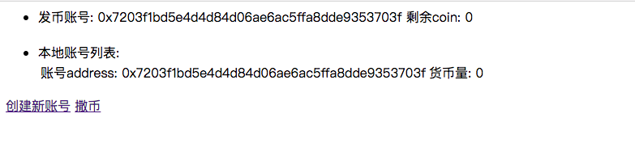
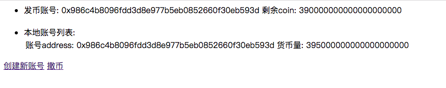
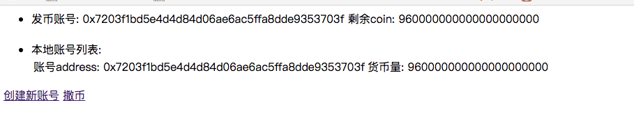
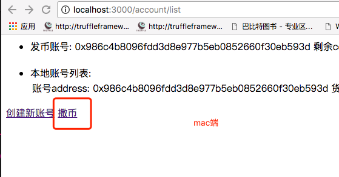
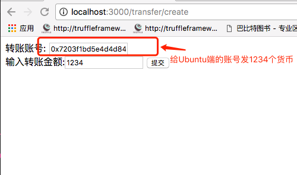
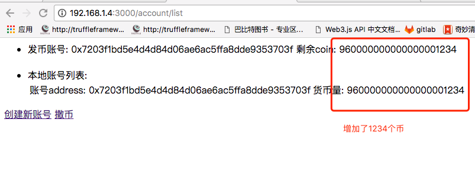

### 安装方式

#### 实现原理

在使用这个项目的时候，最好已经实现过局域网内使用geth客户端，实现了私网交易。其实web3.js也是基于geth的。使用geth开启一个rpc服务，然后web3.js跟进接口和rpc协议，和geth进行通信，再通过geth进行区块的同步操作。

#### 安装条件

 - nodejs
 - web3.js
 - [geth](https://github.com/ethereum/go-ethereum)

 安装的时候，最好已经实现了通过console模式，实现了交易转账。请参考[基于以太坊创建私有链进行挖矿、交易](http://feilong.tech/?p=206)和[基于以太坊实现局域网多节点挖矿](http://feilong.tech/?p=212)

#### Ubuntu端和Mac端

 - 运行geth `geth --datadir data00/ --networked  5201314 --rpc --rpccorsdomain '*' --rpcapi 'eth,personal,net,admin' console`
 - 克隆项目 `https://github.com/tyl569/go-ethereum-nodejs.git`
 - 运行项目 `node index.js`
 - 访问项目 `localhost:3000`

 - 此时两个账号余额应该都是0
 - A和B端进行挖矿, 然后停止B端挖矿，使用A端给B端转账
 - 此时A端和B端的账号余额
 
 

 - 开始进行转账操作
 
 
 

#### `因为交易是先写到本地的区块，然后再同步到其他的区块，所以交易的时候，可能会有时间戳差`

 